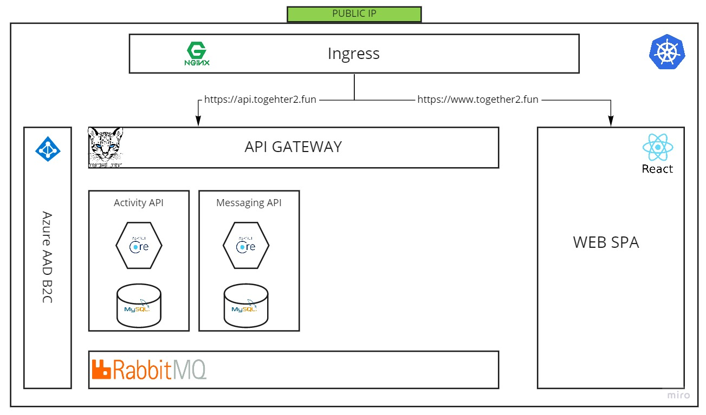

# TOGETHER

## Microservice application based on Azure cloud
1. [使用 Azure AD B2C 进行认证授权](https://zengande.github.io/)
2. [将服务部署到 Azure Kubernetes Service](https://zengande.github.io/)
3. [通过 Azure API Management 发布 API](https://zengande.github.io/)
4. [AKS 与 APIM](https://zengande.github.io/)
5. [Azure Monitor 监控 AKS 中的微服务应用](https://zengande.github.io/)
6. [Azure Devops CI/CD](https://zengande.github.io/)
