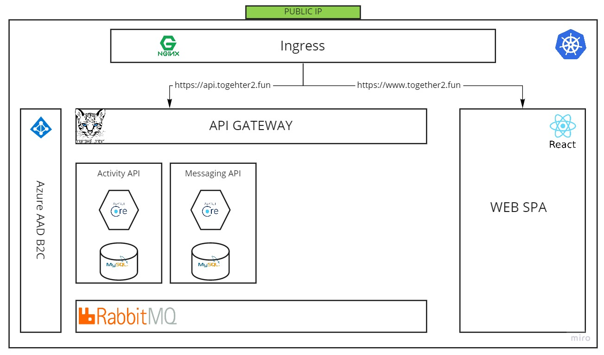
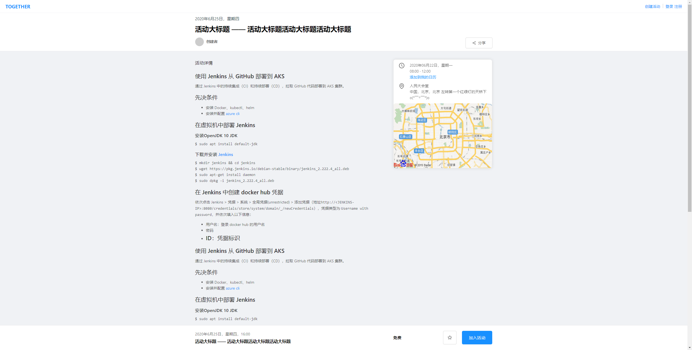

# [TOGETHER](https://together2.fun)

## Screen shots

## Microservice application based on Azure cloud
1. [使用 Azure AD B2C 进行认证授权](https://zengande.github.io/)
2. [将服务部署到 Azure Kubernetes Service](https://zengande.github.io/)
3. [Ingress Nginx Controller](https://zengande.github.io/)
4. [Ocelot 网关](https://zengande.github.io/)
5. [使用 Jenkins 从 GitHub 部署到 AKS](./docs/deploy-from-github-to-aks.md)
6. [基于 EFK 的日志收集系统](https://zengande.github.io/)
