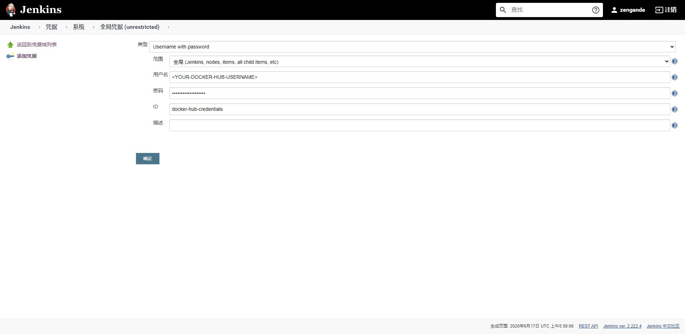
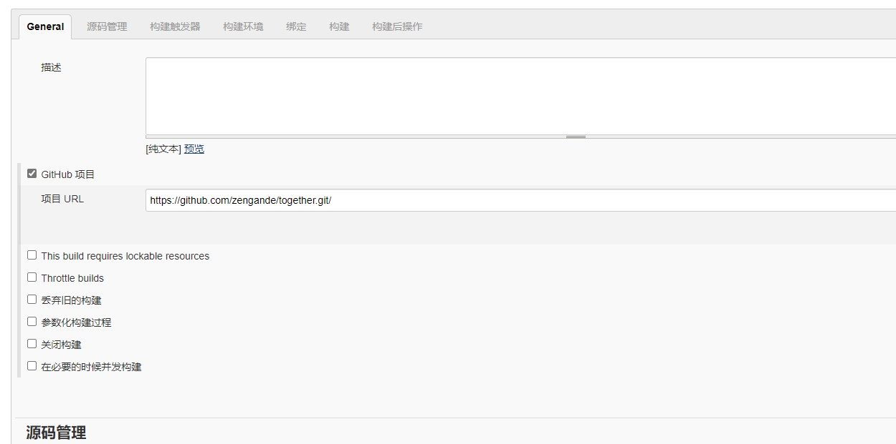
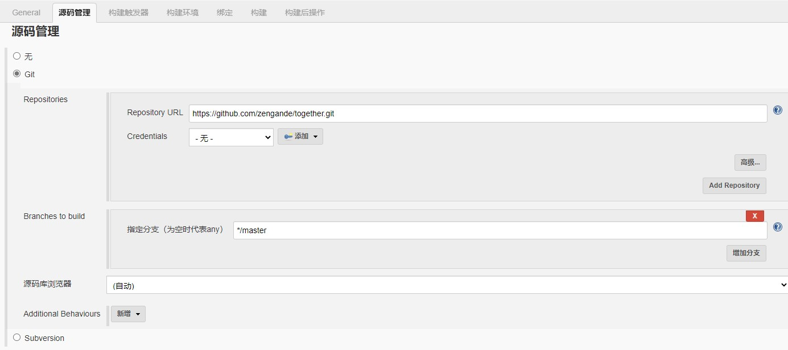
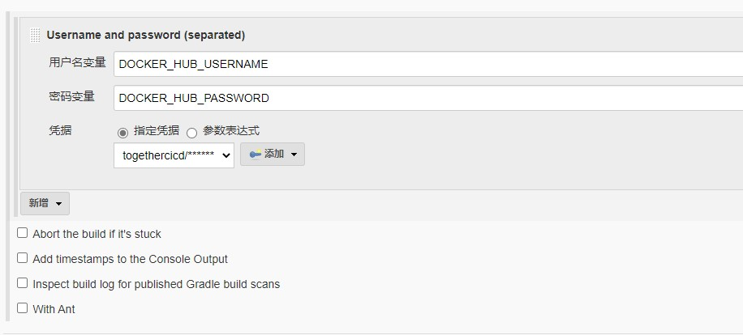
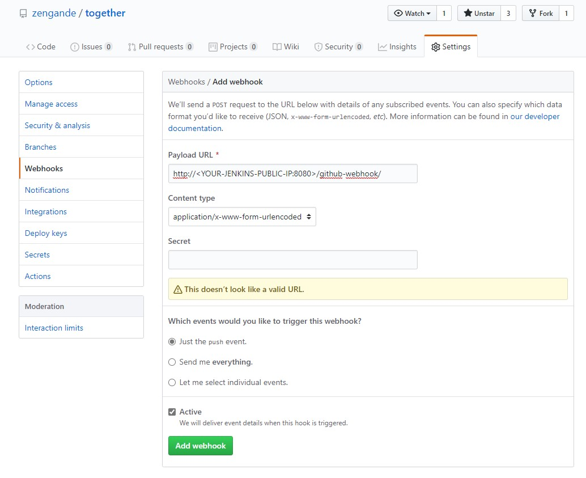
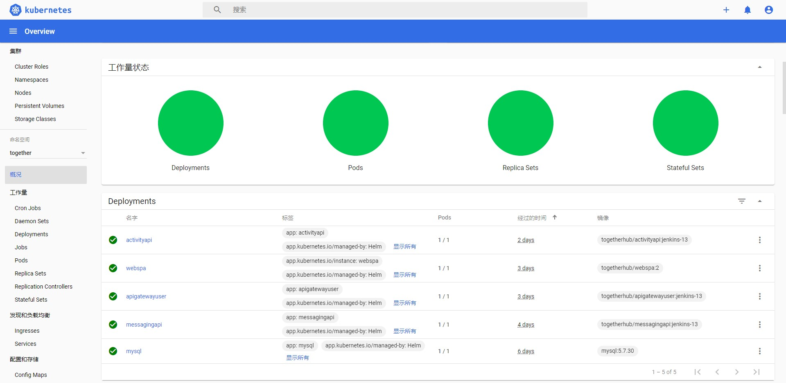

# 使用 Jenkins 从 GitHub 部署到 AKS
通过 Jenkins 中的持续集成（CI）和持续部署（CD），拉取 GitHub 代码部署到 AKS 集群。

## 先决条件
* 安装 Docker、kubectl、helm
* 安装并配置 [azure cli](https://docs.microsoft.com/zh-cn/cli/azure/install-azure-cli)

## 在虚拟机中部署 Jenkins
### 安装OpenJDK 10 JDK
`$ sudo apt install default-jdk`
### 下载并安装 [Jenkins](https://www.jenkins.io/)
```
$ mkdir jenkins && cd jenkins
$ wget https://pkg.jenkins.io/debian-stable/binary/jenkins_2.222.4_all.deb
$ sudo apt-get install daemon
$ sudo dpkg -i jenkins_2.222.4_all.deb
```

## 在 Jenkins 中创建 docker hub 凭据
依次点击 Jenkins > 凭据 > 系统 > 全局凭据(unrestricted) > 添加凭据（地址`http://<JENKINS-IP>:8080/credentials/store/system/domain/_/newCredentials`），凭据类型为 `Username with password`，并依次填入以下信息：
* 用户名：登录 docker hub 的用户名
* 密码
* ID：凭据标识



## 创建并配置 Jenkins 项目
在 Jenkins 主页点击 `新建任务`
1. 输入任务名称，选择 `构建一个自由风格的软件项目`。
2. 在 `General` 中选择 `GitHub 项目` 并输入 `项目 URL`

3. 在 `源码管理` 中，选择 `Git` 并输入 `Repository URL`

4. 在 `构建触发器` 中选择 `GitHub hook trigger for GITScm polling`
5. `构建环境` 选择 `Use secret text(s) or file(s)`
6. 在 `绑定` 中，依次点击 `添加` > `Username with password（separated）`，然后选择此前添加的 docker hub 凭据，并输入 `用户名变量` 和 `密码变量`
* 用户名变量：`DOCKER_HUB_USERNAME`
* 密码变量: `DOCKER_HUB_PASSWORD`

7. 在构建中添加 `执行 shell`
* Build & Push images
``` bash
# 镜像名称
ACTIVITYAPI_IMAGE_NAME="togetherhub/activityapi:jenkins-${BUILD_NUMBER}"
MESSAGINGAPI_IMAGE_NAME="togetherhub/messagingapi:jenkins-${BUILD_NUMBER}"
APIGATEWAYUSER_IMAGE_NAME="togetherhub/apigatewayuser:jenkins-${BUILD_NUMBER}"
WEBSPA_IMAGE_NAME="togetherhub/webspa:jenkins-${BUILD_NUMBER}"

# 构建镜像
docker build -t $ACTIVITYAPI_IMAGE_NAME -f ./src/microservices/Activity/Activity.API/Dockerfile .
docker build -t $MESSAGINGAPI_IMAGE_NAME -f ./src/microservices/Messaging/Messaging.API/Dockerfile .
docker build -t $APIGATEWAYUSER_IMAGE_NAME -f ./src/apigateways/ApiGateway.User/Dockerfile .
docker build -t $WEBSPA_IMAGE_NAME -f ./src/webapps/webspa/Dockerfile .

# 登录 docker hub
docker login -u ${DOCKER_HUB_USERNAME} -p ${DOCKER_HUB_PASSWORD}

# 推送到 docker hub
docker push $ACTIVITYAPI_IMAGE_NAME
docker push $MESSAGINGAPI_IMAGE_NAME
docker push $APIGATEWAYUSER_IMAGE_NAME
docker push $WEBSPA_IMAGE_NAME
```
* Deploy
``` bash
IMAGE_TAG="jenkins-${BUILD_NUMBER}"
KUBE_CONFIG_PATH="/var/lib/jenkins/config"

helm upgrade --install activityapi ./k8s/helm/activityapi/ -f ./k8s/helm/inf.yaml --set image.tag=$IMAGE_TAG --namespace together --kubeconfig $KUBE_CONFIG_PATH
helm upgrade --install messagingapi ./k8s/helm/messagingapi/ -f ./k8s/helm/inf.yaml --set image.tag=$IMAGE_TAG --namespace together --kubeconfig $KUBE_CONFIG_PATH
helm upgrade --install apigatewayuser ./k8s/helm/apigatewayuser/ -f ./k8s/helm/inf.yaml -f ./k8s/helm/ingress-values.yaml --set image.tag=$IMAGE_TAG --namespace together --kubeconfig $KUBE_CONFIG_PATH
helm upgrade --install webspa ./k8s/helm/webspa/ -f ./k8s/helm/inf.yaml -f ./k8s/helm/ingress-values.yaml --set image.tag=$IMAGE_TAG --namespace together --kubeconfig $KUBE_CONFIG_PATH
```
9. 完成保存

## 创建 GitHub Webhook
1. 在 GitHub 存储库中点击 `Settings`，然后转到 `Webhooks`
2. 点击 `Add webhook`，输入以下信息：
* Payload URL：`http://<YOUR-JENKINS-PUBLIC-IP:8080>/github-webhook/`

3. 保存添加

## 测试完整 CI/CD 管道
修改代码后推送到 GitHub，Jenkins 将会自动启动生成作业，并从 GitHub 拉取最新代码，生成、推送镜像，最终部署到 AKS 集群中
